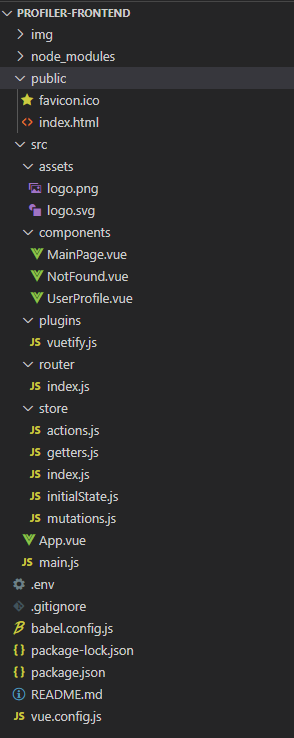
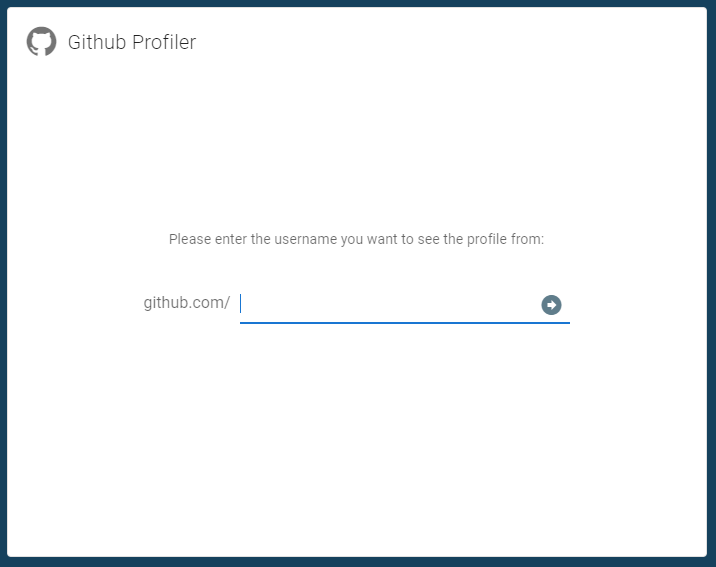
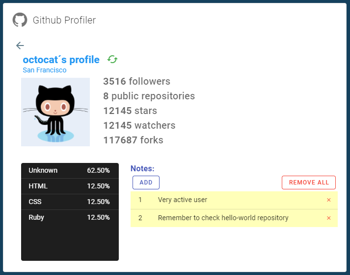

# profiler-frontend

Github Profiler UI.

Github Profiler displays important information about a Github user´s profile and allows to insert notes.
We created our project using vue-cli and added Vuetify to help build our UI.

[VuetifyJS](https://vuetifyjs.com/)
[Vue CLI](https://cli.vuejs.org/)

### Project structure


### Main page


### Profile Page



## Project setup
```
npm install
```

### Compiles and hot-reloads for development
```
npm run serve
```

### Compiles and minifies for production
```
npm run build
```

### Lints and fixes files
```
npm run lint
```

